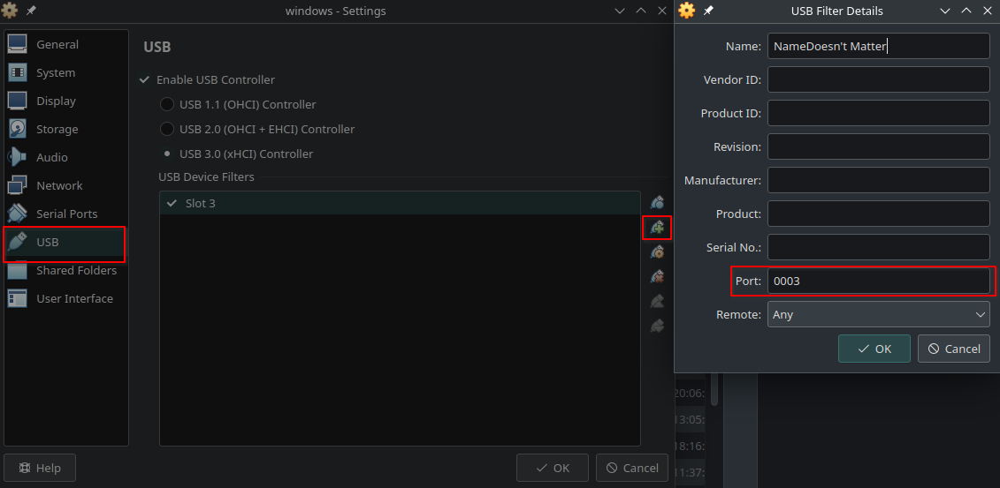

# Firmware Update / Flashing Instructions

There are multiple ways to update the controller firmware which require different technical skills. The easiest method
is using an Xbox Console. If you do not own one, you may want to ask a friend who does.

The next easiest method is using a Windows PC. If you are using dual-boot or have access to a Windows PC, we recommend
that method.

The last method requires some technical skills and installing a Windows VM in Linux. This is quite easy and safe, too,
but you need to follow the instructions quite strictly.

---

## Firmware Update Using an Xbox Console (Recommended)

If you have access to an **Xbox console** (Xbox One, Xbox Series S, or Xbox Series X), this is the **simplest and
safest way** to update your controller’s firmware.

Many users are not aware that controller firmware updates can be performed directly on an Xbox console.


### Advantages

- **No Windows PC required**
- **No virtual machines or USB passthrough**
- **No risk of soft-bricking during flashing**
- Firmware is installed **directly by Microsoft**


### Requirements

- An Xbox console (your own, or one belonging to a friend or family member)
- An internet connection on the console
- A USB cable (recommended) or a wireless connection


### Steps

1. Power on the Xbox console
2. Connect the controller to the Xbox (USB cable recommended, wireless also works)
3. Open **Settings**
4. Navigate to
   **Devices & connections → Accessories**
5. Select the controller
6. If a firmware update is available, the Xbox will prompt you automatically
7. Follow the on-screen instructions to complete the update

Once the update is finished, you can reconnect the controller to your Linux system and use it normally.


### When this method is strongly recommended

* You do not have access to a Windows PC
* You want to avoid virtual machines entirely
* You previously experienced USB passthrough issues
* You want the lowest-risk update method available

---

## Firmware Flashing under Linux Using a Windows VM

Updating the firmware of Xbox controllers currently requires Windows. If you do not have a native Windows installation,
this can be done safely using a virtual machine – **but only if USB passthrough is configured correctly**.

**Important note about “bricking”**

What users often describe as “bricking” during firmware updates is almost always a **temporary soft-brick**:

- During flashing, the controller switches into a **bootloader mode**
- In this mode, the USB **Product ID (PID) changes**
- If the VM does not automatically re-attach the device after this PID change, the update may appear to hang or fail

In almost all cases, this can be recovered by unplugging the USB cable and removing the batteries. However, incorrect
USB passthrough configuration can still cause failed updates or confusing behavior.

The instructions below are written to **avoid this situation entirely**.

---

## Recommended option (most reliable): Use the Xbox Wireless USB Dongle

If you own an **Xbox Wireless USB Dongle**, this is the **preferred and safest method**:

- The dongle does **not** change its USB PID during controller firmware updates
- Firmware flashing works **wirelessly**
- USB passthrough is stable and does not require special filters
- Follow the instructions for the USB cable method below; the steps are mostly identical

Simply pass the **dongle** through to the Windows VM and update the controller via **Xbox Accessories**.

If you do **not** have the dongle, follow the USB method below carefully.

---

## Firmware Update using VirtualBox or a Windows machine (USB cable method)


### Requirements

If you already have a Windows PC, you can skip the VM and ISO download entirely, and update directly:

- VirtualBox
- Windows 10, download from Microsoft:
  [https://www.microsoft.com/software-download/windows10ISO](https://www.microsoft.com/software-download/windows10ISO)
- or Windows 11, download from Microsoft:
  [https://www.microsoft.com/software-download/windows11](https://www.microsoft.com/software-download/windows11)

Required for both methods:

- Xbox Accessories app (from Microsoft Store)


### Step 1 – Create and prepare the Windows VM

*Skip this step but install the **Xbox Accessories** app if you already have a Windows machine.*

1. Install VirtualBox
2. Create a new Windows 10 or Windows 11 virtual machine
3. Boot the VM using the Windows 10 or Windows 11 ISO
4. Complete Windows setup
5. Install:
   - All Windows Updates
   - All Microsoft Store updates
   - **Xbox Accessories** from the Microsoft Store
6. Shut down the VM

So far, everything is standard Windows setup.


### Step 2 – Prevent Linux from interfering with USB passthrough (important)

*Skip this step if you don't use a VM but a native Windows machine.*

On some systems, the legacy `xpad` driver is loaded automatically. This driver makes the controller appear as an
Xbox 360 controller, which **breaks USB passthrough for firmware flashing**.

To prevent this temporarily:

1. Create a new file in `/etc/modprobe.d/` (the filename does not matter, it just needs to end in `.conf`)
2. Add the following line:

   ```conf
   blacklist xpad
   ```
3. Reboot your Linux system

This ensures the controller is passed to the VM **unchanged**.

> You can safely undo this later.


### Step 3 – Configure USB passthrough correctly (critical step)

*Skip this step if you don't use a VM but a native Windows machine.*

1. Plug the controller into your PC via USB
2. Open the VM **Settings**
3. Go to **USB**
4. Click **“Add new USB filter from device”** (USB icon with a plus)
5. Select your controller or the dongle from the list



Now the important part:

6. The USB filter must match the physical USB port, not the device ID
7. Edit the newly created USB filter
8. **Remove all fields except**:
   - `Port`
   - `Name` (can be anything you like)

This ensures:

- The controller stays attached to the VM even when it switches into bootloader mode
- The firmware update will **not** abort due to a PID change


### Step 4 – Update the firmware

1. Start the Windows VM or your Windows machine
2. Launch **Xbox Accessories**
3. The controller should now appear correctly
4. Perform the firmware update

**Important:**

- Keep the controller plugged into the **same physical USB port** throughout the update.
- Do **not** unplug the controller during the update.


### Step 5 – Cleanup (optional)

*Skip this step if you didn't blacklist `xpad` earlier.*

If you want to use the legacy `xpad` driver again (e.g. for wired gameplay):

1. Remove the blacklist file created earlier
2. Reboot

---

## Troubleshooting / Recovery

If something goes wrong during flashing:

- This does not damage the controller permanently
- Unplug the controller from USB if applicable (the dongle can stay plugged in)
- Remove the batteries
- Wait a few seconds
- Reconnect and try again

This resolves almost all cases of "bricked" controllers.

---

## Summary

- Firmware flashing via VM **is safe** if USB passthrough is configured correctly
- PID changes during bootloader mode are expected behavior
- Incorrect USB filters are the most common cause of failed updates
- Using the **Xbox Wireless USB Dongle** avoids all PID-related issues and is strongly recommended
