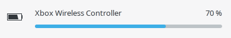

[](https://ko-fi.com/O4O43SURE)

If you want to support me or accelerate the development of a special feature, consider a small donation :heart:
Just leave a message if your donation is for a specific use (like a new hardware or a specific function).

[](https://dev.azure.com/dollingerflorian/dollingerflorian/_build/latest?definitionId=1?branchName=master)
[](https://www.codacy.com/app/atar-axis/xpadneo?utm_source=github.com&amp;utm_medium=referral&amp;utm_content=atar-axis/xpadneo&amp;utm_campaign=Badge_Grade)
[](http://isitmaintained.com/project/atar-axis/xpadneo "Average time to resolve an issue")
[](https://repology.org/project/xpadneo/versions)
[](https://discord.gg/nCqfKa84KA)


# Advanced Linux Driver for Xbox One Wireless Gamepad


Quote from [@atar-axis (Florian Dollinger)](https://github.com/atar-axis), creator of the initial driver:

> This is the first driver for the Xbox One Wireless Gamepad (which is shipped with the Xbox One S). I wrote it for a
> student project at fortiss GmbH and it is fully functional but does only support the connection via Bluetooth as
> yet - more will follow.
>
> Many thanks to *Kai Krakow* who **sponsored** me a Xbox One Wireless Controller :video_game: (including Wireless
> Adapter) and a pack of mouthwatering guarana cacao :coffee:


## Other Projects

* [xow](https://github.com/medusalix/xow) is a driver for the Xbox One S controllers, too, and supports the native
  dongles packaged with the controller. Kudos to [@medusalix](https://github.com/medusalix) for working together on
  finding some work-arounds for controller firmware bugs.
* [xpad](https://github.com/paroj/xpad) supports this and many other controllers in USB mode.
* [xone](https://github.com/medusalix/xone) is a driver aiming for fully supporting all Microsoft GIP devices thus
  replacing the xpad driver in the kernel while adding support for additional types of hardware but it's currently
  still lacking support for dongle, only wired devices are supported by now. It will replace xow at some time in the
  future and is a kernel driver instead of running in user space.
* [MissionControl](https://github.com/ndeadly/MissionControl) aims to support the controller on Nintendo Switch via
  Bluetooth.

These other projects may not support some of the advanced features of xpadneo.


## Breaking Changes

### Kernel 4.18 or newer required

As of xpadneo v0.10, we require kernel 4.18 or later to utilize `HID_QUIRK_INPUT_PER_APP` which splits the gamepad into
multiple sub-devices to fix problems and incompatibilities at several layers.


### SDL 2.0.12 Breakage

As of SDL 2.0.12, SDL introduced a new HIDAPI which can read HID devices in raw mode, bypassing the drivers. Due to
the way SDL works, and because xpadneo exposes hidraw devices as user-readable, SDL may see wrong button mappings
because it may make wrong assumptions about the protocol mode of Xbox and compatible controllers. If you see wrong
button mappings / missing buttons in SDL applications, or rumble does not work, you may need to turn off this behavior
by setting an environment variable in your profile: `SDL_JOYSTICK_HIDAPI=0`

Observed problems:

* Wrong mappings when using newer SDL2 versions, should be fixed by latest xpadneo
* Rumble doesn't work at all, needs to be fixed by SDL2


## Advantages of this driver

* Supports Bluetooth
* Supports all Force Feedback/Rumble effects through Linux `ff-memless` effect emulation
* Supports [Trigger Force Feedback](https://www.youtube.com/watch?v=G4PHupKm2OQ) in every game by applying a
  pressure-dependent effect intensity to the current rumble effect (not even supported in Windows)
* Supports disabling FF
* Supports multiple Gamepads at the same time (not even supported in Windows)
* Offers a consistent mapping, even if the Gamepad was paired to Windows/Xbox before, and independent of software
  layers (SDL2, Stadia via Chrome Gamepad API, etc)
* Working Select, Start, Mode buttons
* Correct Axis Range (signed, important for e.g. RPCS3)
* Supports Battery Level Indication (including the Play 'n Charge Kit)
  
* Easy Installation
* Agile Support and Development
* Supports customization through profiles (work in progress)
* Optional high-precision mode for Wine/Proton users
* Share button support on supported controllers
* Works as a mouse if you're are in couch-mode (press <key>Guide</key>+<key>Select</key>)


### Xbox One S Wireless controller

This is the initial controller supported from the first version of xpadneo. All features are fully supported. This
controller uses emulated profile switching support (see below).


### Xbox Elite Series 2 Wireless controller

Basic support for the Xbox Elite Series 2 Wireless controller is present, covering all the features of the driver.
The following features are missing:

- The four paddles at the bottom are currently not supported.
- Upload of profile mappings and sensitivity curves is currently not supported.

This controller uses native profile switching support (see below).


### Xbox Series X|S Wireless controller

Full support for the Xbox Series X|S controller is present including the share button. This is currently mapped
to keyboard event `KEY_RECORD` and may not work at all for any purpose. Thus, this implementation details may
change during one of the next updates. This controller uses emulated profile switching support (see below).

This controller uses BLE (Bluetooth low energy) and can only be supported if your Bluetooth dongle also supports BLE.

**Known problems:** The controller may not properly set its connection parameters, resulting in laggy and choppy
input experience. See also: [Troubleshooting](https://atar-axis.github.io/xpadneo/#troubleshooting).


### 8BitDo controllers

This driver supports the Nintendo layout of those controllers to exposes them correctly as button A, B, X, and Y
as labelled on the device. This is swapped compared to the original Xbox controller layout. However, this feature is
not enabled by default. If you want to use this feature, you have to add a quirk flag to the module options:

```
# /etc/modprobe.conf
options hid_xpadneo quirks=E4:17:D8:xx:xx:xx:32
```

where you replace `xx:xx:xx` with the values from your controller MAC (as shown in `dmesg`). The value `32` enables
Nintendo layout. If you'll want to add other quirk flags, simply add the values,
e.g. `32` + `7` (default quirks for 8BitDo) = `39`. After changing this, reload the driver or reboot.

This controller uses emulated profile switching support (see below).

**Breaking change:** Users of previous versions of the driver may want to remove their custom SDL mappings. Full
support has been added for these controllers and broken mapping of previously versions no longer needs to be
applied. See also: [SDL](https://atar-axis.github.io/xpadneo/#troubleshooting#sdl).


## Profile switching

The driver supports switching between different profiles, either through emulation or by using the hardware
switch that comes with some models. This switching can be done at any time even while in a game. The API for
customizing each profile does not exist yet.


### Native profile switching support

The driver support native profile switching for the Xbox Elite Series 2 controller. However, the feature is not
finalized yet:

- All four profiles behave the same way currently, and there is no support for configuring them. This may be
  different if profiles have been configured in Windows already, that is still untested.


### Emulated profile switching support

The driver emulates profile switching for controllers without a hardware profile switch by pressing buttons A, B, X,
or Y while holding down the Xbox logo button. However, the following caveats apply:

- Profiles currently behave all the same, and there is no support for configuring them.
- Full support will be available once the Xbox Elite Series 2 controller is fully supported.
- If you hold the button for too long, the controller will turn off - we cannot prevent that.


## Getting started

### Distribution packages

If your distribution has a maintained package, you can just use that and do not need to follow the manual install
instructions below:

[](https://repology.org/project/xpadneo/versions)


### Prerequisites

Make sure you have installed *dkms*, *linux headers* and a bluetooth implementation (e.g. *bluez*) and their dependencies.

* On **Arch** and Arch-based distros (like **Antergos**), try
  `sudo pacman -S dkms linux-headers bluez bluez-utils`
* On **Debian** based systems (like Ubuntu) you can install those packages by running
  ``sudo apt-get install dkms linux-headers-`uname -r` ``
* On **Fedora**, it is
  ``sudo dnf install dkms make bluez bluez-tools kernel-devel-`uname -r` kernel-headers-`uname -r` ``
* On **Manjaro** try
  `sudo pacman -S dkms linux-latest-headers bluez bluez-utils`
* On **OSMC** you will have to run the following commands
  ``sudo apt-get install dkms rbp2-headers-`uname -r` ``
  ``sudo ln -s "/usr/src/rbp2-headers-`uname -r`" "/lib/modules/`uname -r`/build"`` (as a [workaround](https://github.com/osmc/osmc/issues/471))
* On **Raspbian**, it is
  `sudo apt-get install dkms raspberrypi-kernel-headers`
  If you recently updated your firmware using `rpi-update` the above package may not yet include the header files for your kernel. Please follow the steps described [here](https://github.com/notro/rpi-source/wiki) in this case.
* On **generic distributions**, it doesn't need DKMS but requires a configured kernel source tree, then:
  `cd hid-xpadneo && make modules && sudo make modules_install`

Please feel free to add other Distributions as well!


### Installation

* Download the Repository to your local machine
  `git clone https://github.com/atar-axis/xpadneo.git`
* `cd xpadneo`
* If using DKMS, run `sudo ./install.sh`
* If not using DKMS, follow steps above (generic distribution)
* Done!


### Connection

* `sudo bluetoothctl`
* `[bluetooth]# scan on`
* wait until all available devices are listed (otherwise it may be hard to identify which one is the gamepad)
* push the connect button on upper side of the gamepad, and hold it down until the light starts flashing fast
* wait for the gamepad to show up in bluetoothctl, remember the <MAC> address (e.g. `C8:3F:26:XX:XX:XX`)
* `[bluetooth]# scan off` to stop scanning as it may interfere with properly pairing the controller
* `[bluetooth]# pair <MAC>`
* `[bluetooth]# trust <MAC>`
* `[bluetooth]# connect <MAC>` (should usually not be needed but there are [open bugs](https://github.com/atar-axis/xpadneo/issues/198))
* The `<MAC>` parameter is optional if the command line already shows the controller name

You know that everything works fine when you feel the gamepad rumble ;)


### Configuration

* If using DKMS: Use `sudo ./configure.sh` to configure the driver as you wish. The script will guide you through the
  available options.


### Update

In order to update xpadneo, do the following

* Update your cloned repo: `git pull`
* If using DKMS: Run `sudo ./update.sh`
* otherwise follow the steps above (generic distribution)


### Uninstallation

* If using DKMS: Run `sudo ./uninstall.sh` to remove all installed versions of hid-xpadneo
* otherwise follow the steps above (generic distribution)


## Further information

For further information please visit the GitHub Page https://atar-axis.github.io/xpadneo/ which is generated
automatically from the content of the `/docs` folder.

You will find there e.g. the following sections

* [Troubleshooting](https://atar-axis.github.io/xpadneo/#troubleshooting)
* [Debugging](https://atar-axis.github.io/xpadneo/#debugging)
* [Compatible BT Dongles](https://atar-axis.github.io/xpadneo/#bt-dongles)
